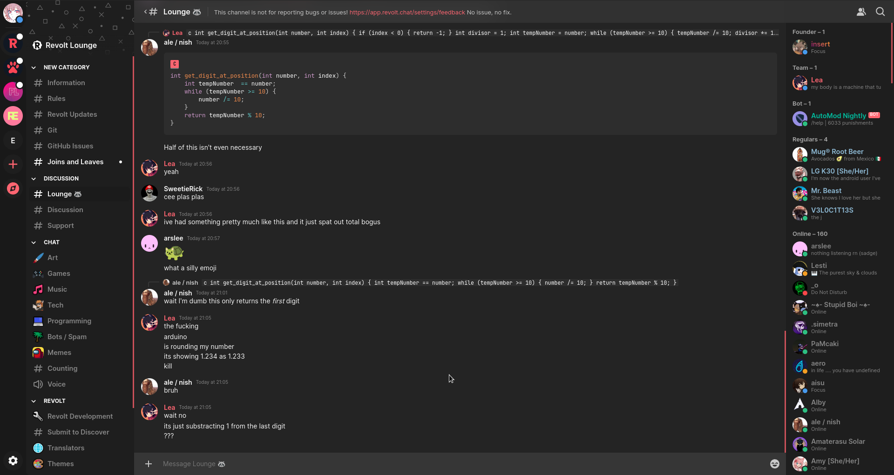
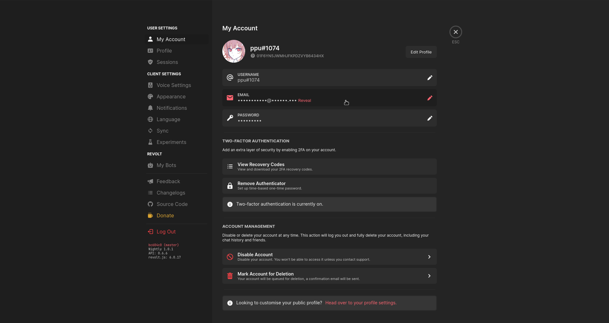
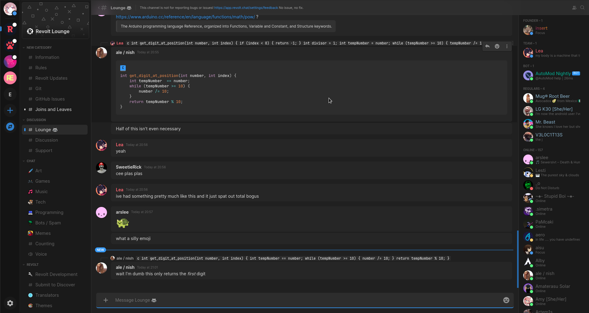
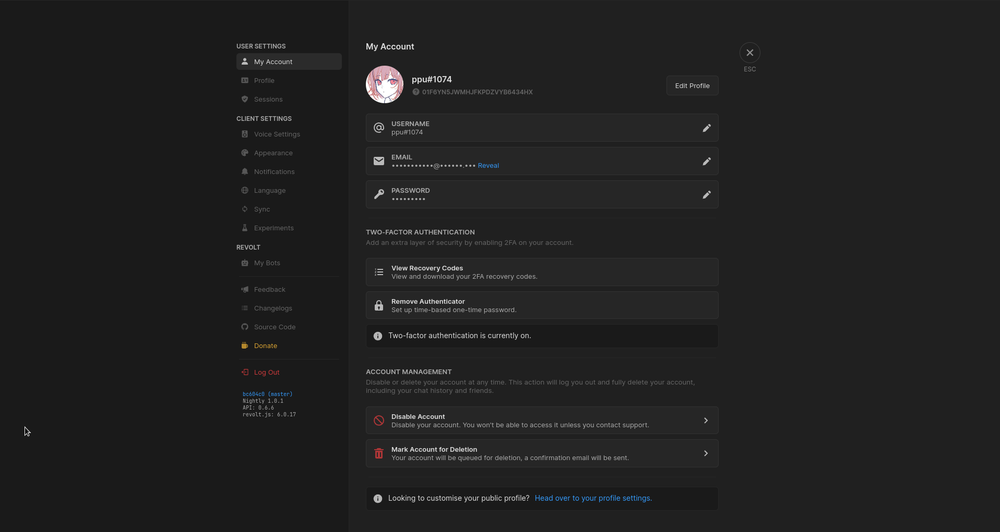
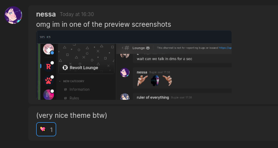

# Fin

Fin aims to enhance the visual appeal of Revolt, giving it a more refined, clean, and modern look.

## Usage

To apply the changes to Revolt, import the provided configuration. You can find the configuration file here:

```
https://raw.githubusercontent.com/meppu/fin/deploy/theme.json
```

## Screenshots

Take a look at these screenshots:

<details><summary>Original</summary>





</details>

<details><summary>Fin</summary>







</details>

## License

Fin is licensed under the MIT License.
